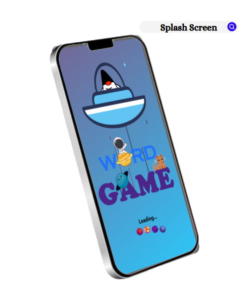
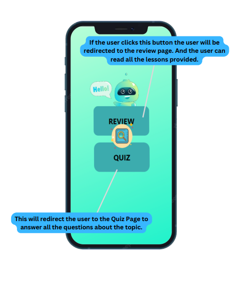
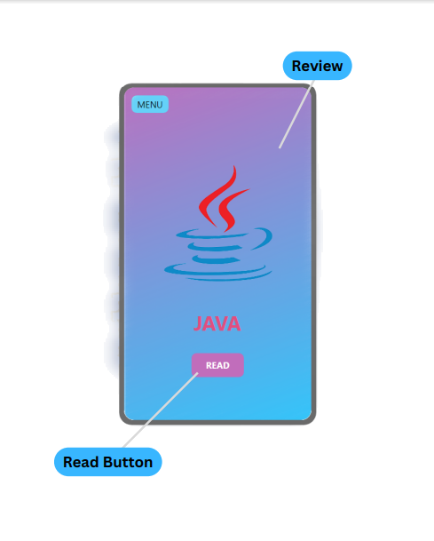
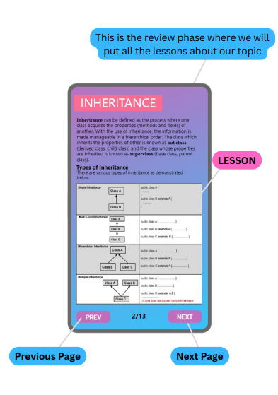
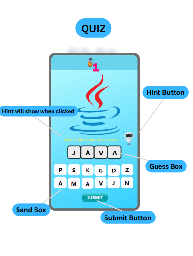
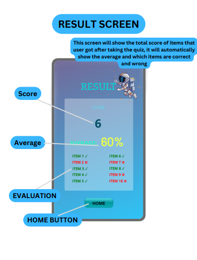

# Word-Game
Word Game app that includes lesson about Object Oriented Programming
### Project Date: October 7, 2022 - November 5, 2022
## Concept of the application:
We have came up with an idea to create a word guessing game. The topic that we have chosen is Object-OrientedProgramming in Java where user will guess the correct answer by picking the letters inside the sandbox. We provided 10 items regarding this topic. We will provide resources or a lesson about Object-Oriented Programming and do a 10 items quiz after that to test the knowledge of the user. And after the quiz we will evaluate the score that the user got in the quiz and display the score and average in the result screen.

